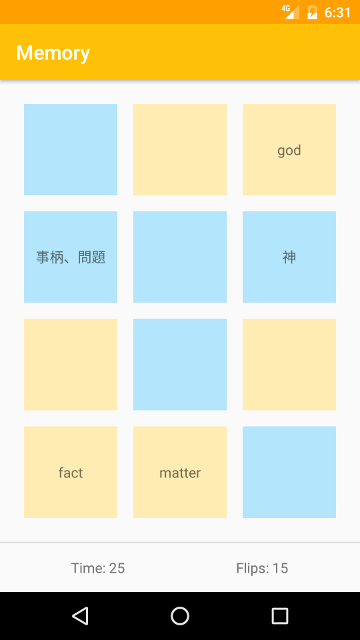
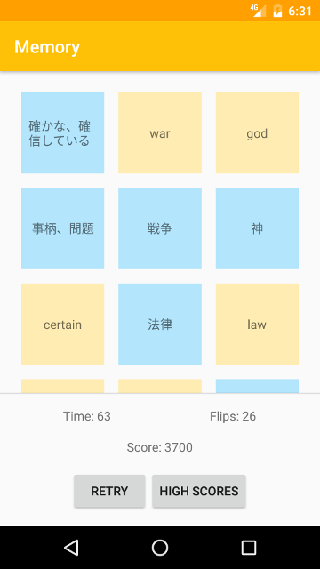

# Memory

This project is a small memory game, where cards are flipped over to find pairs of corresponding words in Japanese and English with the same meaning.

It uses [iKnow.jp](http://iknow.jp/)'s API to provide content for the game.

## Libraries

Here is a list of the libraries used:

* [Gson](https://github.com/google/gson): To parse the JSON the API returns.
* [Retrofit](https://github.com/square/retrofit): To request the API.
* [Butterknife](https://github.com/JakeWharton/butterknife): To simplify views and resources binding.
* [ORMLite](http://ormlite.com/): To store the scores in a database.

This project uses [this template](https://github.com/googlesamples/android-architecture/blob/todo-mvp) as an inspiration to do MVP. However, the fragment approach is not really pertinent here, an Android `View` would be better.

## Improvements

The current state of the project is fine, but here is a list of improvements to consider:

* It doesn't have any test right now, but it needs some.
* The `MainActivity` UI is far from good, the `MainActivity` could even be deleted.
* The API request takes a long time to complete. The results are not cached because usually the request id would change, but a cache or a lightweight request would be better.
* The game board should be rotated on device rotation (it's currently streched).

